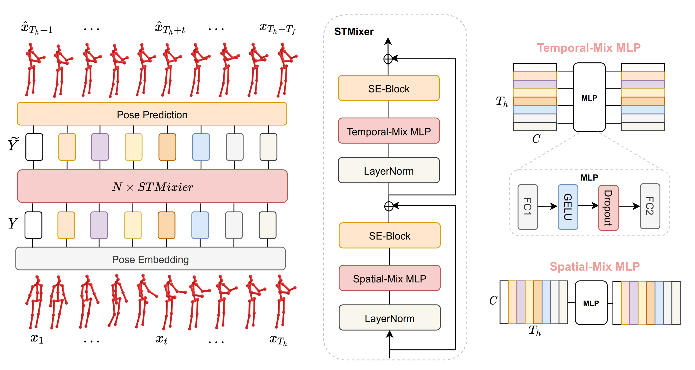

<div align="center">

<h1>MotionMixer: MLP-based 3D Human Body Pose Forecasting </h1>


Official PyTorch Implementation of the paper: MotionMixer: MLP-based 3D Human Body Pose Forecasting.

Arij Bouazizi, Adrian Holzbock, Ulrich Kressel, Klaus Dietmayer and Vasileios Belagiannis


 [[Proceedings](https://www.ijcai.org/proceedings/2022/0111.pdf)] [[Papers with Code](https://paperswithcode.com/paper/motionmixer-mlp-based-3d-human-body-pose)] [[Arxiv](https://arxiv.org/abs/2207.00499)]


</div>


<div align="right">

</div>

## Installation

To setup the environment:
```sh
cd MotionMixer
conda create -n MotionMixer python=3.8.8
conda activate MotionMixer
pip install -r requirements.txt
```

## Data

Due to licensing it is not possible to provide any data. Please refer to [STSGCN](https://github.com/FraLuca/STSGCN) for the preparation of the dataset files.

## Training

To train the model on h36m or amass, you can use the following commands:
 ```
 python h36m/train_mixer_h36m.py --input_n 10 --output_n 25 --skip_rate 1 
 ```
 ```
 python amass/train_mixer_amass.py --input_n 10 --output_n 25 --skip_rate 5 
 ```
 
 ## Evaluation

To test the pretrained models, you can use the following commands:
 ```
 python h36m/test_mixer_h36m.py --input_n 10 --output_n 25 --skip_rate 1 
 ```
 ```
 python amass/test_mixer_amass.py --input_n 10 --output_n 25 --skip_rate 5 
 ```
 
 ## Models

We release the pretrained models for academic purpose. You can download them from [Google Drive](https://drive.google.com/drive/folders/1SrZpoe__Q3YXdk_TrtcxeJzRQiKAWoT5). Unzip the .zip file in the ```/checkpoints``` directory.

## Citation

If you find this code useful for your research, please consider citing the following paper:

```latex
@inproceedings{ijcai2022p111,
  title     = {MotionMixer: MLP-based 3D Human Body Pose Forecasting},
  author    = {Bouazizi, Arij and Holzbock, Adrian and Kressel, Ulrich and Dietmayer, Klaus and Belagiannis, Vasileios},
  booktitle = {Proceedings of the Thirty-First International Joint Conference on
               Artificial Intelligence, {IJCAI-22}},
  publisher = {International Joint Conferences on Artificial Intelligence Organization},
  pages     = {791--798},
  year      = {2022},
  month     = {7},
}

```

 ## Acknowledgments
 
 Some of our code was adapted from [HisRepsItself](https://github.com/wei-mao-2019/HisRepItself) and [STSGCN](https://github.com/FraLuca/STSGCN). We thank the authors for making their code public.
 
## License

<a rel="license" href="http://creativecommons.org/licenses/by-nc/4.0/">
</a><br />This work is licensed under <a rel="license" href="http://creativecommons.org/licenses/by-nc/4.0/"
 >Creative Commons Attribution-NonCommercial 4.0 International License</a>.
